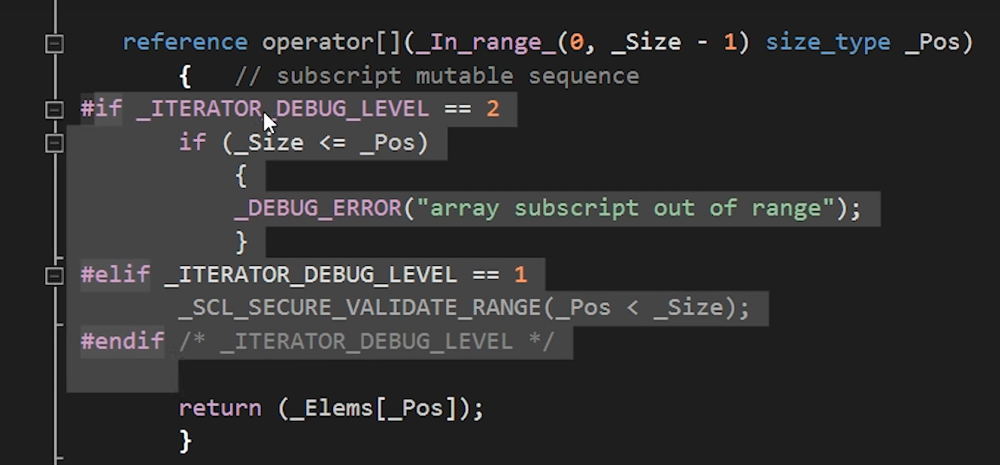

you can provide the underlying data type that the data structure handles

### vector --- dynamic array
初始化声明的时候, 不必传入大小, 动态分配内存


### optimization
1. know your environment
   when and why copying happen?
   vecotr的resize流程, 分配内存--copy--move---delete原来的
   1. copy constructro
   2. const reference


## templates
not quite like generics, a bit of like macro
the complier writes the code for you, based on the code that you give


```
template<typename T> 
void Print(T value)
{
    std::cout << value << std::endl;
}
// gets created when we actually call it
// the template does not exist until we call it --- 不过也看compiler MSVC是这样的, clang就不是

template<typename T, int N>
class Array
{
private:
    T m_array[N];
public:
    int GetSize() const {return N;}
};


int main()
{
    Array<std::string, 5> array;
    array.GetSize();
    Print<int>(5);
}
```


### static array
```
#include <array>
 
 std::array<int, 5> // 得规定大小, 并且大小固定, 存储在栈上
```
 optional bounds checking--- 取决于当前处于debug模式还是release模式
 debug模式会指出越界, release模式可能不会检查, 直接复写
 


 