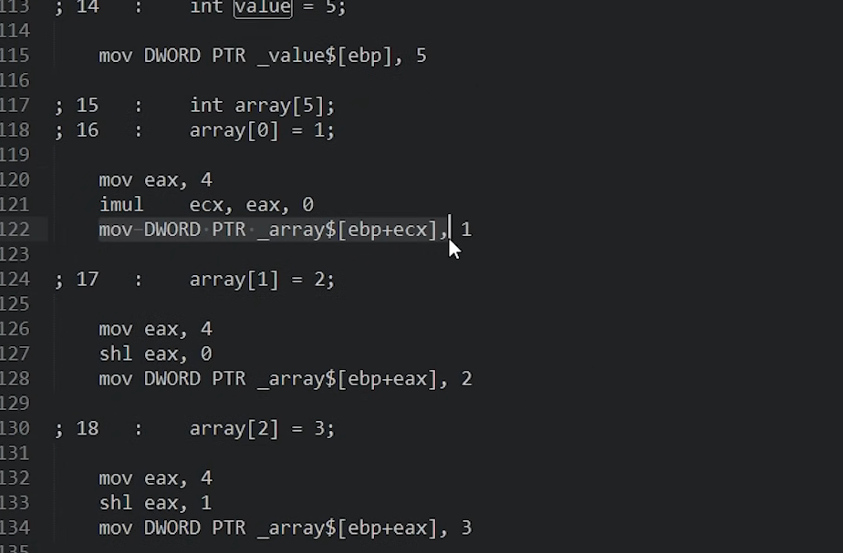

two areas in RAM
**区分主要是如何分配内存**

## Stack
an area of memory that has a predefined size usually around 2 MB
交由stack pointer管理, 4Bytes分配之后, 栈指针会往上移动, 指向分配的4Bytes的开头
跟随scope消亡

allocation on the stack is one CPU instruction
```
int value = 5;
```


## Heap
new--- malloc --- 维护一个空闲内存块的free list, 分配给回指针
delete
```

```